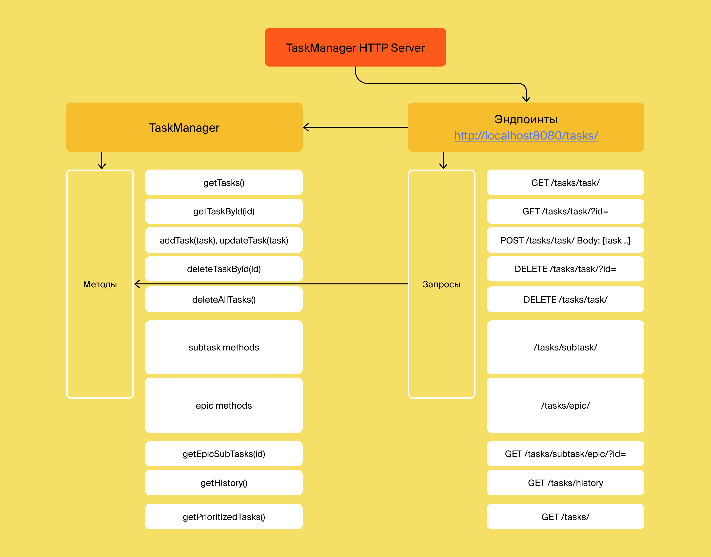

# Трекер задач
> Stack: Java 11, JUnit
> 

Как человек обычно делает покупки? Если ему нужен не один продукт, а несколько, то очень вероятно, что сначала он составит список, чтобы ничего не забыть. Сделать это можно где угодно: на листе бумаги, в приложении для заметок или, например, в сообщении самому себе в мессенджере.

А теперь представьте, что это список не продуктов, а полноценных дел. И не каких-нибудь простых вроде «помыть посуду» или «позвонить бабушке», а сложных — например, «организовать большой семейный праздник» или «купить квартиру». Каждая из таких задач может разбиваться на несколько этапов со своими нюансами и сроками. А если над их выполнением будет работать не один человек, а целая команда, то организация процесса станет ещё сложнее.

### Типы задач
Простейшим кирпичиком такой системы является задача (англ. task). У задачи есть следующие свойства:
1. Название, кратко описывающее суть задачи (например, «Переезд»).
2. Описание, в котором раскрываются детали.
3. Уникальный идентификационный номер задачи, по которому её можно будет найти.
4. Статус, отображающий её прогресс. Мы будем выделять следующие этапы жизни задачи:
   1. `NEW` — задача только создана, но к её выполнению ещё не приступили.
   2. `IN_PROGRESS` — над задачей ведётся работа.
   3. `DONE` — задача выполнена.
5. `duration` — продолжительность задачи, оценка того, сколько времени она займёт в минутах (число); 
6. `startTime` — дата, когда предполагается приступить к выполнению задачи. 
7. `getEndTime()` — время завершения задачи, которое рассчитывается исходя из `startTime` и `duration`.
   
Иногда для выполнения какой-нибудь масштабной задачи её лучше разбить на подзадачи (англ. subtask). Большую задачу, которая делится на подзадачи, мы будем называть эпиком (англ. epic).

Таким образом, в нашей системе задачи могут быть трёх типов: обычные задачи, эпики и подзадачи. Для них должны выполняться следующие условия:
- Для каждой подзадачи известно, в рамках какого эпика она выполняется.
- Каждый эпик знает, какие подзадачи в него входят.
- Завершение всех подзадач эпика считается завершением эпика.

### Менеджеры
Менеджер
Кроме классов для описания задач, вам нужно реализовать класс для объекта-менеджера. Он будет запускаться на старте программы и управлять всеми задачами. В нём должны быть реализованы следующие функции:
1. Возможность хранить задачи всех типов.
2. Методы для каждого из типа задач(Задача/Эпик/Подзадача):
   1. Получение списка всех задач.
   2. Удаление всех задач.
   3. Получение по идентификатору.
   4. Создание. Сам объект должен передаваться в качестве параметра.
   5. Обновление. Новая версия объекта с верным идентификатором передаётся в виде параметра.
   6. Удаление по идентификатору.
3. Дополнительные методы:
   1. Получение списка всех подзадач определённого эпика.
4. Управление статусами осуществляется по следующему правилу:
   1. Менеджер сам не выбирает статус для задачи. Информация о нём приходит менеджеру вместе с информацией о самой задаче. По этим данным в одних случаях он будет сохранять статус, в других будет рассчитывать.

   2. Для эпиков:

      - если у эпика нет подзадач или все они имеют статус `NEW`, то статус должен быть `NEW`.
      - если все подзадачи имеют статус `DONE`, то и эпик считается завершённым — со статусом `DONE`.
      - во всех остальных случаях статус должен быть `IN_PROGRESS`.
5. Получить историю просмотров задач.
6. Вывод списка задач в порядке приоритета.

#### Реализовано 4 вида менеджера:
- `InMemoryTaskManager` - хранит все данные непосредственно на сервере где запущен, сбрасывает все при перезапуске сервера.
- `FileBackedTaskManager` - хранит все данные в csv файле, по умолчанию создается файл `BackedTasks.csv` в корневой директории проекта. При перезапуске загружает данные из этого файла.
- `HttpTaskManager` - хранит данные на удаленном `KVServer` посредством http запросов через `KVClient`, которому при регистрации присваивается уникальный `API_TOKEN`.
- `HistoryManager` - чтобы трекер отображал последние просмотренные пользователем задачи. Он возвращает последние 10 просмотренных задач. Просмотром считается вызов у менеджера методов получения задачи по идентификатору.

### API

#### Эндпоинты:
- Путь для обычных задач — `/tasks/task`
- для подзадач — `/tasks/subtask`,
- для эпиков — `/tasks/epic`. 
- Получить все задачи сразу можно будет по пути `/tasks/`, 
- а получить историю задач по пути `/tasks/history`. 

#### Пример запроса:
>`POST /tasks/task` - создать новую задачу. 
>
>_Request Body:_
>>  { 
>  "iD": 1, 
>  "type": "TASK", 
>  "title": "Buy MILK", 
>  "description": "in pyaterochka" 
>  }

>`GET /tasks/task` - получить все задачи.